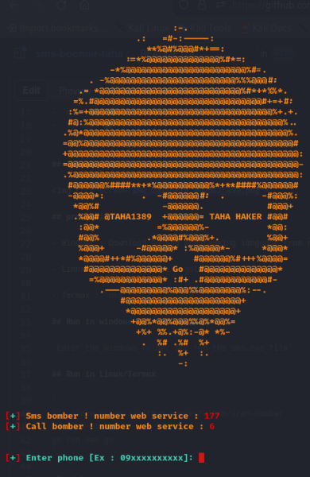

# sms-boomer-taha
# iran-bomber
sms bomber pro irani 🇮🇷v1 with Go (Golang)

<h3>views :</h3>
<br>

## Number of web services 

- Sms : 177 🧨
- Call : 6 🧨

## Speed +

## Support from [tested]
- `Linux` ✅
- `Windows` ✅
- `Termux` ✅


## screen shot



## prerequisite :

- Windows : Download Golang programming language from reputable sites

- Linux : `sudo apt install golang`

- Termux : `pkg install golang`

## Run in windows

`Enter the Windows folder and run the sms.exe file`

## Run in Linux/Termux

```
git clone https://github.com/esfelurm/iran-bomber
cd iran-bomber
go run sms.go
```

 Good bye
